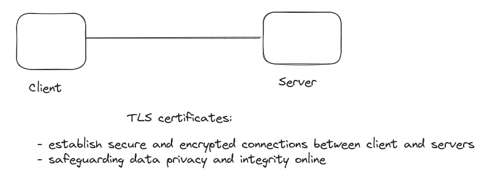
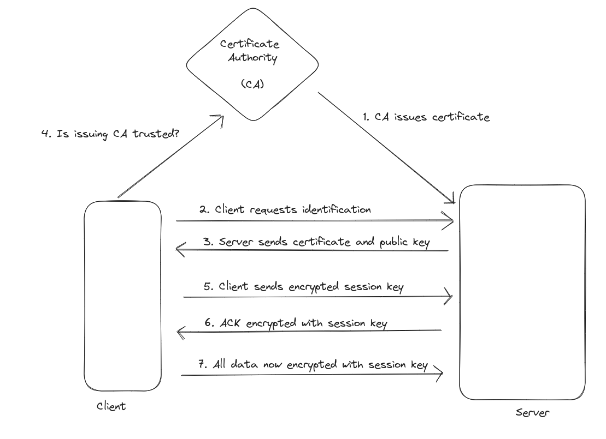

# WIP

### Why



### How




1. Generate your private key using the RSA algorithm:

  - ```openssl genrsa -out  <your.key> 2048```

2. Encoded contents (PEM format) of the private key:

  -  ```cat  <your.key>```

3. The private key file contains both the private key and the public key. You can extract your public key from your private key file if needed.

  -  ```openssl rsa -in <your.key> -pubout -out  <your-public.pem>```

4. Creating your CSR

  -  ```openssl req -new -key  <your.key> -out  <your.csr>```

5. Verifying CSR Info

  -  ```openssl req -text -in <your.csr> -noout -verify```


### Resources

1. https://kodekloud.com/courses/certified-kubernetes-administrator-cka/

2. https://www.digicert.com/kb/ssl-support/openssl-quick-reference-guide.htm

3. https://docs.pexip.com/admin/certificate_management.htm
